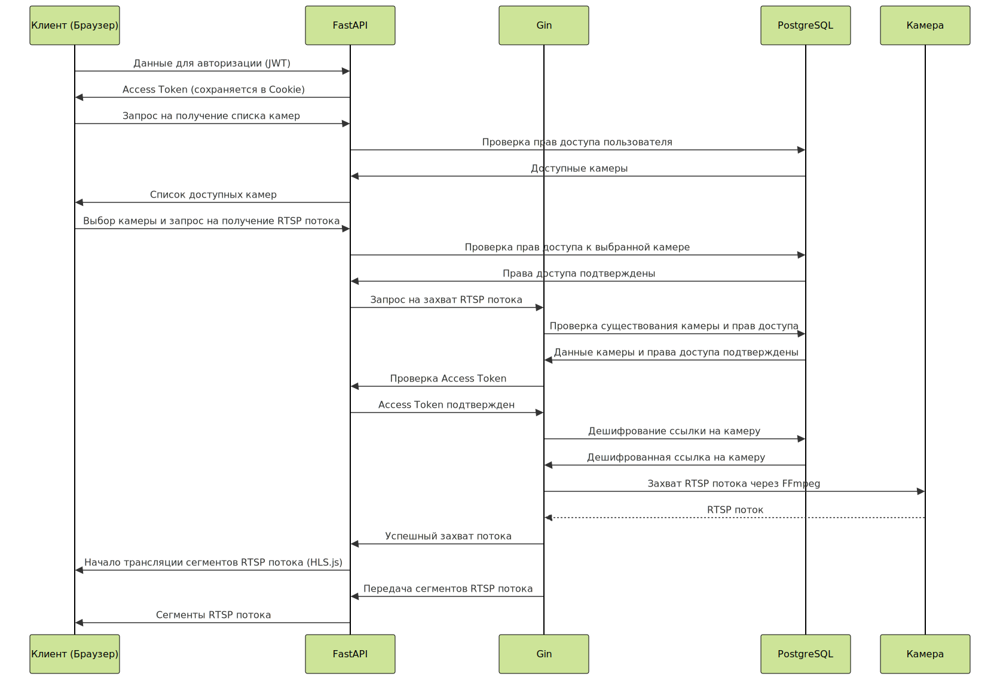

# RTSP Viewer

## Описание

Этот проект представляет собой систему для захвата и трансляции RTSP потоков с камер видеонаблюдения в браузер. Он состоит из двух микросервисов: [FastAPI](https://fastapi.tiangolo.com/) (для авторизации, ролевого разграничения и управления пользователями и потоками) и [Gin](https://gin-gonic.com/) (для захвата и трансляции потоков, а также оптимизации нагрузки). Проект позволяет пользователям добавлять камеры, управлять ими и просматривать потоки в реальном времени через веб-интерфейс.

## Введение

Цель данного проекта – предоставить эффективное и оптимизированное решение для управления и просмотра видеопотока с камер наблюдения в веб-браузере. Система включает две ключевые составляющие:

Микросервис [FastAPI](https://fastapi.tiangolo.com/): Отвечает за авторизацию пользователей (реализованной на основе JWT), ролевое разграничение с правами доступа, предоставляет RESTful API для управления пользователями и потоками видеокамер (добавление, просмотр, обновление, удаление). Включает функционал для удобного добавления камер в базу данных через импорт из Excel-файлов. 
Микросервис [Gin](https://gin-gonic.com/): Отвечает за захват RTSP потоков, оптимизацию нагрузки и доставку потока клиенту посредством HTTP Live Streaming (через [hls.js](https://github.com/video-dev/hls.js)).


## Выбор технологий

Проект изначально разрабатывался полностью на Python с использованием OpenCV, однако разделение проекта на микросервисную архитектуру и переход на Golang позволил значительно снизить нагрузку на сервер. При обработке четырех RTSP потоков одновременно на Ryzen 5 5600 с 16 ГБ ОЗУ, нагрузка на сервер снизилась со 100% до всего лишь 2%. Golang оказался идеальным выбором для создания высоконагруженного микросервиса благодаря своей высокой производительности и эффективности управления памятью.

## Архитектура

Диаграмма ниже иллюстрирует взаимодействие различных компонентов системы:



## Управление потоками

При обращении пользователя к потоку выполняется следующая последовательность шагов:

- Проверка доступности потока. Если поток ещё не был запущен, то инициируется новый процесс захвата.
- Создание списка зрителей. Для каждого запущенного потока ведётся список активных зрителей. Когда пользователь завершает просмотр, его запись удаляется из списка.
- Ограничение числа потоков. Пользователю разрешено просматривать не более 4-х потоков одновременно. При попытке открыть 5-й поток, система автоматически закрывает самый старый открытый поток.
- Освобождение ресурсов. Если ни один зритель не просматривает поток, то захват прекращается для экономии ресурсов.

## Логирование и безопасность

Проект использует написанную вручную систему логирования, которая фиксирует все важные события (начало и завершение просмотра потоков, ошибки, сбои и т.д.) Это помогает отслеживать состояние системы и своевременно реагировать на возникающие проблемы.

Кроме того, в системе предусмотрены меры безопасности:

- Пароли пользователей хранятся в базе данных в зашифрованном виде.
- RTSP-ссылки камер шифруются перед сохранением в базе данных.
- Доступ к функциям управления камерами строго контролируется ролями пользователей.

## Права доступа пользователей

Ролевое разграничение имеет следующий вид:
| Роль       | Права доступа                                                                 |
|------------|--------------------------------------------------------------------------------|
| Пользователь | - просмотр своих камер (списком и по отдельности)<br>- добавление/удаление камер из избранного |
| Модератор  | - все права пользователя<br>- добавление камеры<br>- удаление камеры<br>- редактирование камеры<br>- просмотр всех камер<br>- просмотр конкретной камеры по id<br>- просмотр камер пользователя            |
| Администратор | - все права модератора<br>- редактирование пользователя<br>- удаление пользователя<br>- регистрация пользователей<br>- просмотр всех пользователей              |


## Планы на будущее
В дальнейшем планируется расширение функционала системы. В частности, будут реализованы следующие возможности:

- Аналитика работы камер. Разработка сервиса для ежедневной проверки состояния всех подключённых камер. Будут проводиться тесты на работоспособность путём захвата нескольких кадров, а также собираться статистические данные о наиболее популярных камерах и количестве одновременных просмотров.
- Оптимизация работы Gin. Чтобы повысить надежность и скорость обработки данных о взаимодействиях пользователей, планируется перенести эту информацию в Redis, отказавшись от использования обычных переменных внутри Gin. Это поможет устранить ошибки, возникающие из-за текущих маппингов, а также повысит доступность и устойчивость системы.

## Установка и запуск

### Шаг 1: Клонирование репозитория

```bash
git clone https://github.com/Petyall/rtsp_viewer.git .
```

### Шаг 2: Инициализация FastAPI 
##### Шаг 2.1: Создание и активация виртуального окружения 

Для Linux/macOS:
```bash
python3 -m venv venv
source venv/bin/activate или 
```

Для Windows:
```bash
python -m venv venv
.\venv\Scripts\activate
```

##### Шаг 2.2: Установка необходимых зависимостей 
```bash
pip3 install -r requirements.txt
```

##### Шаг 2.3: Инициализация .env файла (пример данных изображен в файле .env_example)
```bash
touch .env
```

##### Шаг 2.4: Запуск локального сервера 
```bash
uvicorn app.main:app
```

### Шаг 3: Инициализация Gin 
##### Шаг 3.1: Скачать и установить [FFmpeg](https://www.ffmpeg.org/download.html)

##### Шаг 3.2: Переход в директорию с Gin
```bash
cd .\rtsp_streamer\cmd\server\
```

##### Шаг 3.3: Инициализация .env файла (пример данных изображен в файле .env_example)
```bash
touch .env
```

##### Шаг 3.4: Запуск локального сервера
```bash
go run main.go
```

## Технологии
В проекте были использованы следующие технологии:

- [FastAPI](https://fastapi.tiangolo.com/) — современный веб-фреймворк для Python;
- [Gin](https://gin-gonic.com/) — самый быстрый полнофункциональный веб-фреймворк для Go;
- [PostgreSQL](https://www.postgresql.org/) — самая совершенная в мире реляционная база данных;
- [FFmpeg](https://www.ffmpeg.org/) — комплексное кроссплатформенное решение для записи, преобразования и потоковой передачи аудио и видео;
- [hls.js](https://github.com/video-dev/hls.js) — библиотека JavaScript, реализующая клиент HTTP Live Streaming;